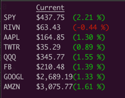
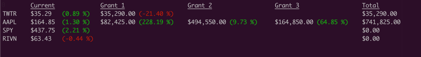

# Equity Tracker

This application is a simple stock and equity tracker that runs in your command line.

# Getting Started - Quick Beginners Guide
1. Clone this repository on your local machine. 
2. Open your Terminal and navigate to this project's root directory. 
3. Run the program by typing, `make run`.
4. Follow the prompts to set up your portfolio. 
5. Refer to the FAQ if you have any questions.

#Features 

## Simple Stock Monitoring



## Tracking Equity Grant Values
This will show you your total percent change of your grant as well as the current value. 



# FAQ

### Where do I get the Finnhub API Key? And will this cost me anything? 
You can get a free API key [here](https://finnhub.io/dashboard). This does not cost anything as you only need to sign up 
for the free tier. 

### What if I want to add another stock or grant?
The easiest way to edit your portfolio is to simply edit the `config.ini` file directly. You must run the program at 
least once in order for the `config.ini` file to exist. You can edit the file using your favorite text editor. 

### How does the `config.ini` file work? 
The file should look like this:
```
[API_TOKENS]
finn_hub_api_key = API_TOKEN_HERE

[DATABASE]
stock_1 = TWTR,1000,44.90
stock_2 = AAPL,500,50.23
stock_3 = AAPL,3000,150.23
stock_4 = SPY,0,0
stock_5 = RIVN,0,0
```
This example above indicates:
1. You have a single grant of TWTR where you were granted 1000 shares at $44.90.
2. You have 2 grants from AAPL. One grant of 500 shares at $50.23 and another grant of 3000 shares at $150.23.
3. You also want to monitor SPY and RIVN, but you do not have any stock grants with them.

### Can I use this app to monitor my investment stock portfolio?  
Depends 🙂. If you have a super simple portfolio it may be manageable, but if you make frequent stock purchases it will 
most likely become too hard to keep track of. You would have to treat every time you purchased stock as its own stock grant. 
But for example, if you only purchased $1,000 of Apple stock once or twice, you could use this app just fine.  

# For the more curious
There are some other command line arguments you can pass in. To see a list of them, run `./venv/bin/python3 -m prod.Main -h`