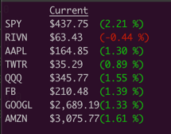
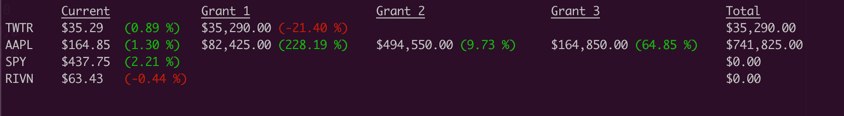

# Equity Tracker

A simple, live stock and equity-grant tracker that runs right in your terminal. Point it at the
stocks you own (or just want to watch), and it streams real-time prices and shows how your grants
are performing — including a per-day range gauge, a mini price chart, and a running portfolio total.

## Features
- **Live prices** streamed over a websocket, with the day's percent change (green/red).
- **Equity grant tracking** — current value and percent change for each grant, plus an estimate of
  your next vest.
- **Multiple grants per stock**, combined on one row or split onto separate rows for grants that
  vest on independent schedules (see [the FAQ](#what-if-two-grants-of-the-same-stock-vest-on-different-schedules)).
- **Day range gauge** showing where the current price sits between today's low and high.
- **Unrealized gain/loss** in dollars for each grant row — how much you're up or down since the
  grant price.
- **Portfolio total footer** with the combined value of all your grants and the total dollar change
  for the day.
- **Connection status + auto-reconnect** so a dropped connection self-heals and you can always see
  whether data is live.
- **Watch-only stocks** you don't own but want to monitor.

# Getting Started - Quick Beginners Guide
1. Clone this repository on your local machine.
2. Open your Terminal and navigate to this project's root directory.
3. Run the program by typing `make run`. (This creates a virtual environment, installs the
   dependencies, and starts the app.)
4. Follow the prompts to set up your portfolio.
5. Refer to the FAQ if you have any questions.

To quit the application at any time, press `Ctrl + C`.

## Simple Stock Monitoring



## Tracking Equity Grant Values
This will show you your total percent change of your grant as well as the current value.



# Reading the Display
Each stock gets its own row. Reading left to right:

```
        Current          Grant 1             Grant 2             Total                       Day Range                   Gain/Loss
RDDT    $166.56 (-1.52 %) $59,461.92 (-23%)  $66,457.44 (12%)    $125,919.36 ($62,959.68)    $160.12 ▕────●─────▏ $171.40  ▼ $36,801.76

Portfolio: $179,720.36  (+$3,410.22 today)
● live
```

- **Current** — the latest price and its percent change vs. yesterday's close.
- **Grant N** — the current value of each grant and its percent change vs. the grant price.
- **Total** — the combined value of that row's grants. The amount in parentheses is the estimated
  value of your **next vest**.
- **Day Range** — a gauge of where the current price sits between today's low and high.
- **Gain/Loss** — the unrealized gain or loss in dollars for that row's grants, versus the grant
  price (▲ green when up, ▼ red when down).
- **Portfolio** (footer) — the total value of every grant plus the combined dollar change for the day.
- **Connection status** (bottom line) — `● live`, `○ connecting…`, or `○ reconnecting…`.

> Note: the gauge and gain/loss columns render to the right of the Total column. On a narrow
> terminal they may be clipped — widen the window to see them. The core columns and footer are
> always shown.

# FAQ

### Where do I get the Finnhub API Key? And will this cost me anything?
You can get a free API key [here](https://finnhub.io/dashboard). This does not cost anything as you
only need to sign up for the free tier.

### What if I want to add another stock or grant?
The easiest way to edit your portfolio is to simply edit the `config.ini` file directly. You must
run the program at least once in order for the `config.ini` file to exist. You can edit the file
using your favorite text editor.

### How does the `config.ini` file work?
The file should look like this:
```
[API_TOKENS]
finn_hub_api_key = API_TOKEN_HERE

[DATABASE]
stock_1 = TWTR,1000,44.90,16
stock_2 = AAPL,500,50.23,8
stock_3 = AAPL,3000,150.23,16
stock_4 = SPY,0,0,0
stock_5 = RIVN,0,0,0
```
Each grant entry is `TICKER,SHARES,GRANT_PRICE,VESTS_LEFT`:
- `TICKER` — the stock symbol (e.g. `AAPL`).
- `SHARES` — how many shares were granted.
- `GRANT_PRICE` — the price per share when it was granted.
- `VESTS_LEFT` — how many vesting events remain (e.g. a 4-year grant vesting quarterly that just
  started would be `16`). This is used to estimate your next vest.

The example above indicates:
1. You have a single grant of TWTR where you were granted 1000 shares at $44.90 with 16 vests left.
2. You have 2 grants from AAPL — one of 500 shares at $50.23, and another of 3000 shares at $150.23.
3. You also want to monitor SPY and RIVN, but you do not have any stock grants with them (a
   **watch-only** stock uses `0` for shares, price, and vests).

### What if two grants of the same stock vest on different schedules?
By default, all grants of the same ticker are combined onto a single row (and their next-vest
estimate is summed). If two grants vest on independent schedules — for example a second grant
that doesn't start vesting until the first one finishes — combining them overstates your next
vest. To put a grant on its own row, add an optional 5th field: a **group label**. Grants that
share a ticker but have different group labels each get their own row with independent totals:
```
[DATABASE]
stock_1 = RDDT,357,216.99,2
stock_2 = RDDT,399,147.86,2,b
```
Here the two RDDT grants render as separate rows, so each row's value, percent change, and
next-vest amount are calculated independently. Grants with no label (or the same label) are
still combined as before.

### Why do prices stop updating sometimes?
The live price stream only sends updates while the market is open. Outside of market hours the
last known prices are shown. The bottom status line tells you the connection state:
- `● live` — connected and streaming.
- `○ connecting…` — fetching the initial quotes.
- `○ reconnecting…` — the connection dropped and is being re-established automatically.

### Can I use this app to monitor my investment stock portfolio?
Depends 🙂. If you have a super simple portfolio it may be manageable, but if you make frequent stock
purchases it will most likely become too hard to keep track of. You would have to treat every time
you purchased stock as its own stock grant. But for example, if you only purchased $1,000 of Apple
stock once or twice, you could use this app just fine.

### Where are the logs?
Diagnostic messages (connection drops, parse errors, etc.) are written to a rotating log file,
`equity_tracker.log`, in the project root. It is ignored by git. This keeps logging from corrupting
the terminal UI while still giving you something to look at if anything goes wrong.

# For the more curious
There are some other command line arguments you can pass in. To see a list of them, run
`./venv/bin/python3 -m prod.Main -h`. The available flags are:

| Flag | Description |
| --- | --- |
| `-t`, `--Token` | Save your Finnhub API token. |
| `-r`, `--Reset` | Remove all stocks and equity amounts (keeps your token). |
| `--NUKE` | Reset the entire config file (you will lose your token and stock list). |

## Running the tests
The unit tests run against the project's virtual environment (created by `make run`):
```
./venv/bin/python3 -m unittest discover -s test -t .
```

## Requirements
- Python 3
- The dependencies in `requirements.txt` (`requests`, `websocket-client`, `certifi`), installed
  automatically by `make run`.
- A terminal that supports UTF-8 (for the gauge and sparkline glyphs).
