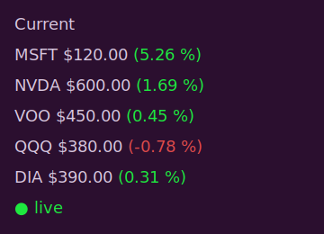
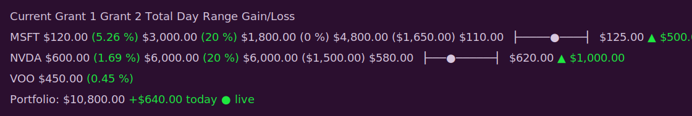

# Equity Tracker

Equity Tracker is a live terminal dashboard for stock watchlists and equity grants. It streams
current prices from Finnhub, shows how each grant is performing, estimates your next vest, and keeps
a running portfolio total in a curses-based UI.

Use it when you want a lightweight way to watch:

- Public stocks you care about.
- Equity grants you hold.
- Multiple grants for the same ticker.
- Watch-only tickers where you do not own shares.

## Screenshots

### Watch-only stock monitoring



### Equity grant tracking



## Features

- Live stock prices over Finnhub websocket updates.
- First-run prompts for token, ticker, grant shares, grant price, vest count, and optional grant group.
- Watch-only stocks by entering `0` shares.
- Multiple grants per stock, combined on one row by default.
- Optional group labels to split same-ticker grants onto separate rows when they vest independently.
- Day-range gauge showing where the current price sits between today's low and high.
- Unrealized gain/loss versus grant price.
- Portfolio footer with total grant value and total dollar change for the day.
- Connection status and automatic reconnect.
- Rotating file logs that do not corrupt the terminal UI.

## Requirements

- Python 3.
- A free Finnhub API token from [finnhub.io/dashboard](https://finnhub.io/dashboard).
- A terminal that supports UTF-8 characters.

Dependencies are listed in `requirements.txt` and installed automatically by `make run` into a local
`venv/`.

## Quick Start

1. Clone the repo.

   ```bash
   git clone https://github.com/akm0012/EquityTracker.git
   cd EquityTracker
   ```

2. Start the app.

   ```bash
   make run
   ```

3. Follow the first-run prompts.

   The app will ask for:

   - Your Finnhub API token.
   - A stock ticker, such as `MSFT`.
   - The number of shares in a grant, or `0` for watch-only.
   - Grant price and vests left, only when shares are greater than `0`.
   - An optional group label for grants that should render on separate rows.

4. Review the setup summary.

   After setup, Equity Tracker prints the saved portfolio and asks whether to start the live tracker.

To quit the live dashboard, press `Ctrl + C`.

## Normal Usage

After first-run setup, use:

```bash
make run
```

The app reads `config.ini`, fetches initial quotes, subscribes to live updates, and opens the terminal
dashboard.

`config.ini` is local-only and ignored by git. Do not commit real API tokens or personal portfolio
data.

## CLI Commands

Run help:

```bash
./venv/bin/python3 -m prod.Main -h
```

Available flags:

| Flag | Description |
| --- | --- |
| `-t`, `--Token` | Save your Finnhub API token. |
| `-r`, `--Reset` | Remove all stocks and equity amounts while keeping your token. |
| `--NUKE` | Reset the entire config file, including token and stock list. |

Example token setup:

```bash
./venv/bin/python3 -m prod.Main --Token YOUR_FINNHUB_TOKEN
```

## Config Guide

The app stores setup in `config.ini` at the project root:

```ini
[API_TOKENS]
finn_hub_api_key = API_TOKEN_HERE

[DATABASE]
stock_1 = MSFT,25,100.00,4
stock_2 = NVDA,10,500.00,4,a
stock_3 = NVDA,8,600.00,4,b
stock_4 = VOO,0,0,0
```

Each stock row is:

```text
TICKER,SHARES,GRANT_PRICE,VESTS_LEFT[,GROUP]
```

| Field | Meaning |
| --- | --- |
| `TICKER` | Public ticker symbol, such as `MSFT`. |
| `SHARES` | Shares in this grant. Use `0` for watch-only stocks. |
| `GRANT_PRICE` | Price per share when the grant was issued. Use `0` for watch-only stocks. |
| `VESTS_LEFT` | Remaining vest events. Used to estimate the next vest. Use `0` for watch-only stocks. |
| `GROUP` | Optional label that puts same-ticker grants on separate rows. |

### Watch-only Stocks

Use `0,0,0` after the ticker:

```ini
stock_1 = VOO,0,0,0
stock_2 = QQQ,0,0,0
```

### A Single Grant

```ini
stock_1 = MSFT,25,100.00,4
```

This means 25 shares of `MSFT`, granted at `$100.00`, with 4 vest events left.

### Multiple Grants For The Same Ticker

By default, same-ticker grants without a group label combine onto one row:

```ini
stock_1 = MSFT,25,100.00,4
stock_2 = MSFT,15,120.00,2
```

This is useful when the grants vest on the same schedule or when one combined row is good enough.

### Independent Same-Ticker Grants

If same-ticker grants vest independently, add a group label as the fifth field:

```ini
stock_1 = NVDA,10,500.00,4,a
stock_2 = NVDA,8,600.00,4,b
```

Those rows render separately, so each row's total and next-vest estimate is calculated independently.
Group labels cannot contain commas.

## Reading The Display

Each stock gets its own row. Reading left to right:

```text
        Current          Grant 1             Grant 2             Total                       Day Range                   Gain/Loss
MSFT    $120.00 (5.26 %)  $3,000.00 (20%)    $1,800.00 (0%)      $4,800.00 ($1,650.00)       $110.00 ▕─────●────▏ $125.00  ▲ $500.00

Portfolio: $4,800.00  (+$240.00 today)
● live
```

- `Current`: latest price and percent change versus yesterday's close.
- `Grant N`: current value of each grant and percent change versus grant price.
- `Total`: combined row value. The amount in parentheses estimates the next vest value.
- `Day Range`: current price position between today's low and high.
- `Gain/Loss`: unrealized dollar gain or loss versus grant price.
- `Portfolio`: total value of every grant plus combined dollar change for the day.
- Connection status: `● live`, `○ connecting…`, or `○ reconnecting…`.

The gauge and gain/loss columns render to the right of the Total column. If they are clipped, widen
the terminal window.

## Troubleshooting

### I do not have a Finnhub token

Create a free token at [finnhub.io/dashboard](https://finnhub.io/dashboard), then either paste it
during first-run setup or save it with:

```bash
./venv/bin/python3 -m prod.Main --Token YOUR_FINNHUB_TOKEN
```

### The app says my ticker is invalid

Make sure the symbol is a public ticker supported by Finnhub. The app validates tickers before saving
them.

### Prices are not changing

Finnhub's live stream sends trade updates while the market is active. Outside market hours, the app
shows the last known price from the initial quote.

### The right side of the display is missing

The dashboard is terminal-width dependent. Widen your terminal to see the day-range and gain/loss
columns.

### I edited `config.ini` and something broke

The app will repair missing config sections and skip malformed stock rows with a warning. Check that
each stock row has at least:

```text
TICKER,SHARES,GRANT_PRICE,VESTS_LEFT
```

### Where are logs?

Diagnostic logs are written to `equity_tracker.log` in the project root. Log files are ignored by git.

## Development

Run the tests:

```bash
./venv/bin/python3 -m unittest discover -s test -t .
```

Remove the virtual environment:

```bash
make clean
```

Then recreate it by running:

```bash
make run
```
